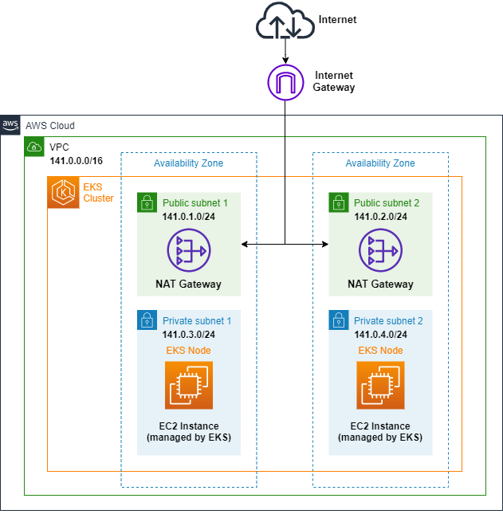

# Terraform - Creating an EKS Cluster with Node Group


## Architecture


## update kubeconfig from Cloud9
```
aws eks update-kubeconfig --region ap-southeast-1 --name eks-cluster
```

## determine IAM Role or User ARN
```
c9builder=$(aws cloud9 describe-environment-memberships --environment-id=$C9_PID | jq -r '.memberships[].userArn')
if echo ${c9builder} | grep -q user; then
	rolearn=${c9builder}
        echo Role ARN: ${rolearn}
elif echo ${c9builder} | grep -q assumed-role; then
        assumedrolename=$(echo ${c9builder} | awk -F/ '{print $(NF-1)}')
        rolearn=$(aws iam get-role --role-name ${assumedrolename} --query Role.Arn --output text) 
        echo Role ARN: ${rolearn}
fi
```

### with ARN, create identity mapping within cluster
```
eksctl create iamidentitymapping --cluster eks-cluster --arn ${rolearn} --group system:masters --username admin
```

### verify entry in AWS auth map
```
kubectl describe configmap -n kube-system aws-auth
```
